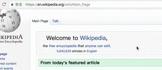

# markme
The browser's implmentment of mark and paint's interaction. \

The effect is shown in figure.



## Usage

### CDN
https://unpkg.com/markme
name: `Markme`

### NPM

```
const markme = require('markme')
const mm = markme(document.body, {
  // options
})
```

#### Options
- enablePlugins
*Default*  `['highlight', 'badge']`

// Wait to be full
...

## Related
* [markme-leancloud](../markme-leancloud) - Use leancloud as data persistence.
* [Use markme-leancloud by Violentmonkey](https://gist.github.com/imcuttle/c345279c6b7a690a5722a8506ba8f1a9)
